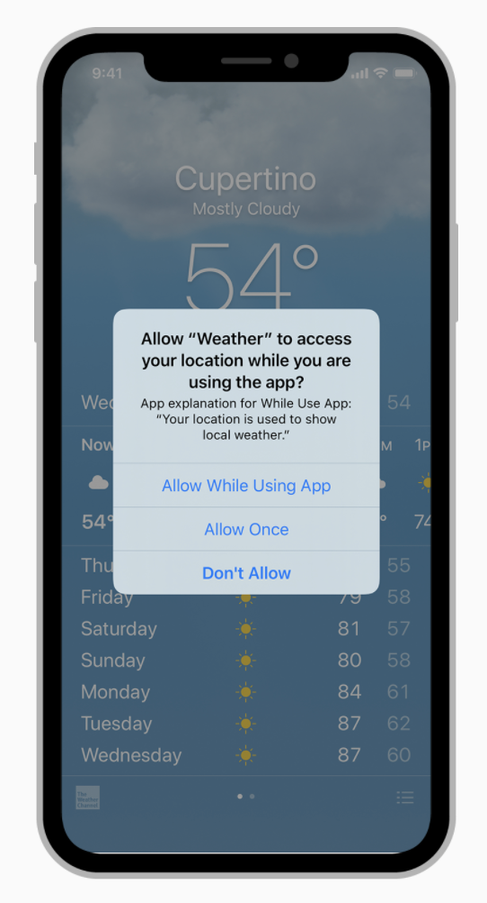
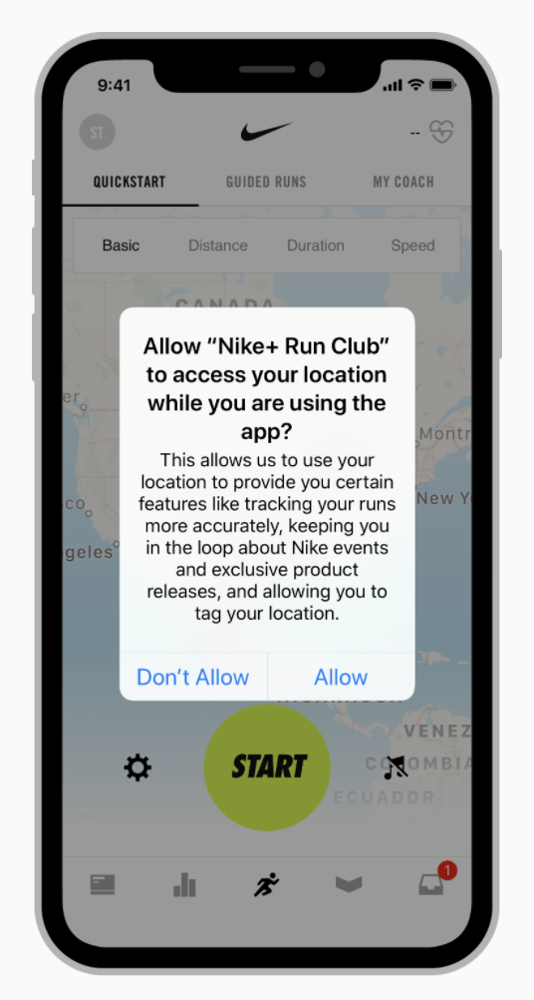
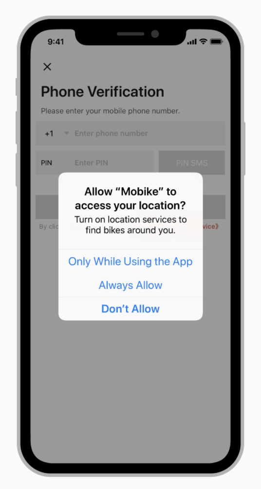
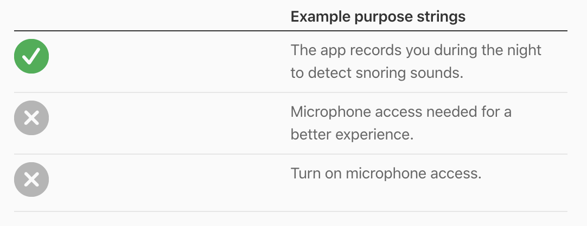

# Requesting Permission
Users must grant permission for an app to access personal information, including the current location, calendar, contact information, reminders, and photos. Although people appreciate the convenience of using an app that has access to this information, they also expect to have control over their private data. For example, people like being able to automatically tag photos with their physical location or find nearby friends, but they also want the option to disable such features.

> 사용자들은 앱이 현재 위치, 달력, 연락처 정보, 주의 사항 및 사진 등을 포함한 개인 정보에 접근할 수 있도록 허용해야 합니다. 사용자들은 이런 정보에 접근할 수 있는 앱 사용의 편리함을 높게 평가하지만, 사용자들은 또한 개인적인 데이터를 통제할 수 있을 것으로 기대합니다. 예를 들어, 사용자들은 그들의 위치에 사진을 자동으로 태그 하거나 근처에 있는 친구를 찾아주는 것을 좋아하지만, 이러한 기능들을 사용하지 않는 옵션 또한 원합니다.

  

**Request personal data only when your app clearly needs it.** It’s natural to be suspicious of a request for personal information, especially if there’s no obvious need for it. Make sure permission requests occur only when people are using features that clearly need personal data. For example, an app might only request access to the current location when activating a location tracking feature.

> **앱에서 반드시 필요할 때, 개인적인 데이터를 요구하세요.** 특히 필요한 이유가 명백하지 않다면, 개인 정보 요청에 의심스러운 것은 자연스럽습니다. 권한 요청은 사용자가 반드시 개인적인 데이터를 필요로 하는 기능을 사용할 때만 일어난다는 것을 유의하세요. 예를 들어, 위치 추적하는 기능을 활성화할 때, 앱은 현재 위치에 대한 접근 요청을 할 것입니다.

|                   Example Purpose String 1                   |                   Example Purpose String 2                   | Example Purpose String 3                                     |
| :----------------------------------------------------------: | :----------------------------------------------------------: | ------------------------------------------------------------ |
|  |  |  |

**Explain why your app needs the information.** Provide custom text (known as a *purpose string* or *usage description string*) for display in the system's permission request alert, and include an example. Keep the text short and specific, use sentence case, and be polite so people don't feel pressured. There’s no need to include your app name—the system already identifies your app. For developer guidance, see [Protecting the User's Privacy](https://developer.apple.com/documentation/uikit/core_app/protecting_the_user_s_privacy).

> **앱에서 정보가 필요한 이유를 설명하세요.** 시스템 권한 요청 알림에 표시할 custom text(purpose string 또는 usage description string으로 열려진)를 제공하고, 예시를 포함하세요. Text를 짧고 구체적으로 유지하며, sentence case를 사용하고, 사용자가 부담을 느끼지 않도록 공손하게 하세요. 시스템이 이미 앱을 식별하여, 앱의 이름은 필요하지 않습니다. Protecting the User's Privacy와 관련된 내용은 다음 문서를 참조하세요.

  

**Request permission at launch only when necessary for your app to function.** Users won’t be bothered by this request if it’s obvious that your app depends on their personal information to operate.

> **앱에서 작동하는 데 필요한 경우에만, 시작 시 권한을 요청하세요.** 앱에서 동작하기 위해서 반드시 개인 정보가 필요하다면, 사용자들은 이러한 요청을 귀찮아하지 않을 것입니다.

**Don’t request location information unnecessarily.** Before accessing location information, check the system to see whether Location Services is enabled. With this knowledge, you can delay the alert until a feature truly requires it, or perhaps avoid the alert altogether. To learn how to implement location features, see [MapKit](https://developer.apple.com/documentation/mapkit) and [Location and Maps Programming Guide](https://developer.apple.com/library/content/documentation/UserExperience/Conceptual/LocationAwarenessPG/Introduction/Introduction.html).

> **불필요하게 위치 정보를 요구하지 마세요.** 위치 정보에 접근하기 전에 시스템을 확인하여 위치 서비스가 사용 가능한지 확인하세요. 이런 정보로 기능이 실제로 필요할 때까지 알림을 늦추거나, 하지 않을 수 있습니다. 위치 기능 구현 방법을 배우기 위해서 MapKit과 Location and Maps Programming Guide 문서를 참조하세요.

**Use the system-provided alert.** You can customize text in the standard permission alert, but avoid adding custom prompts that replicate the standard alert’s behavior or appearance.

> **시스템에서 제공하는 알림을 사용하세요.** 기본 사용 권한 요청 알림의 텍스트를 커스텀 할 수 있지만, 기본 알림의 동작이나 모양을 복제하는 커스텀 프롬프트 추가는 지양하세요.